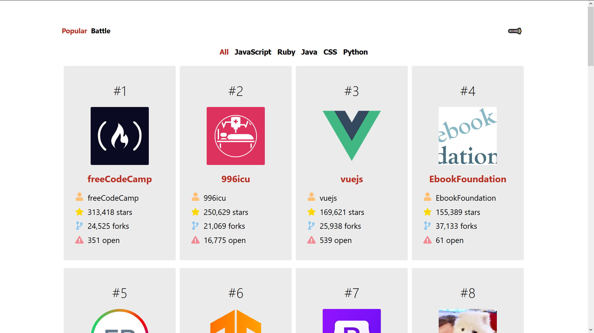
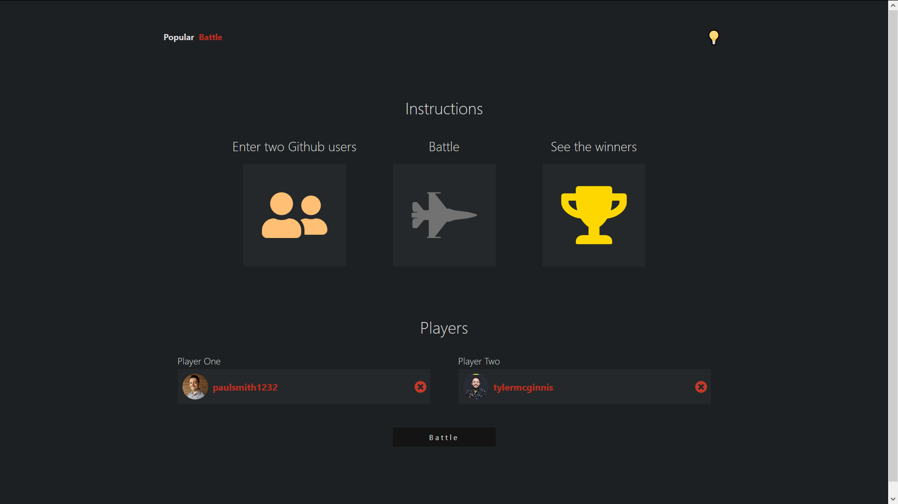
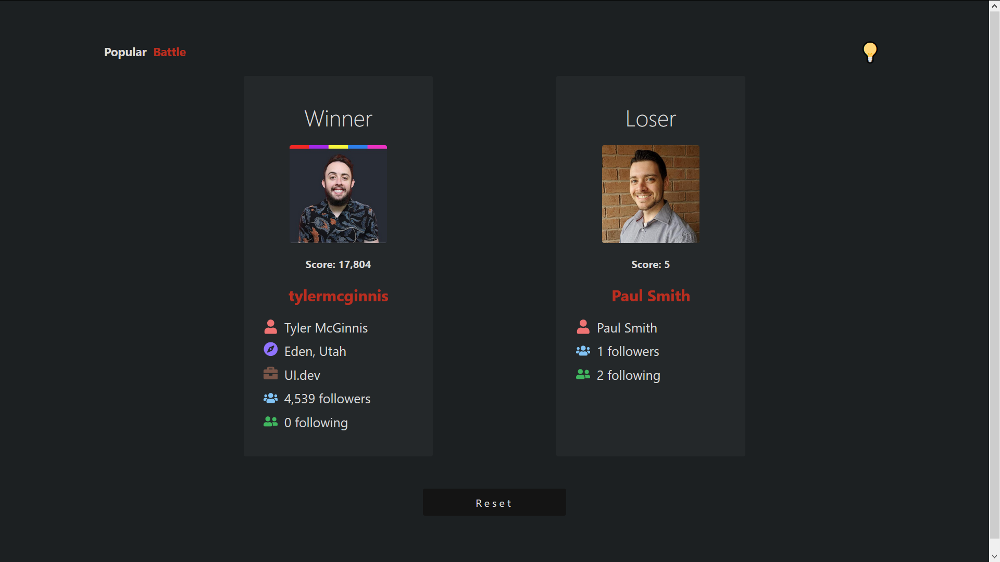

# github-battle-update
Updated version of github battle project for UI.dev course on [React fundamentals](https://ui.dev/react/). Made using HTML/CSS/JS and, of course, React.

Compares top repositories of various languages and allows one to compare and *battle* different users.

<a href="https://focused-mccarthy-9ac50f.netlify.app/" target="_blank" title="Weather App">Live demo!</a>

---
###### The landing page:

###### The battle page:

###### The battle page results:

